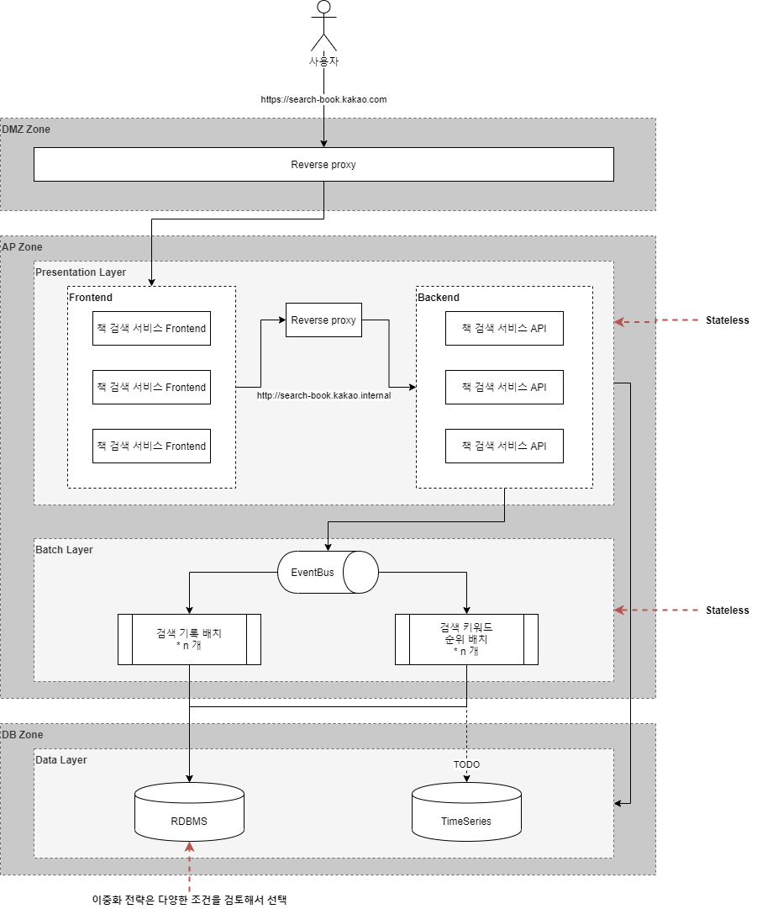

# 1. 구성

## 구성도(약식)

# 2. 기본 요구사항

* 회원가입/로그인
* 책 검색
* 내 검색 히스토리
* 인기 키워드 목록
 
# 3. API Endpoint
## 3-1. 회원가입

* URL : http://localhost:8080/api/v1/auth/register-do
* Method : POST
* Parameter

| Name | Type | Description |
|----------|:------:|:-------------------|
| email    | String | 로그인시 사용할 이메일 |
| password | String | 사용할 암호          |
| userName | String | 사용자 이름          |

## 3-2. 로그인

* URL : http://localhost:8080/api/v1/auth/login-do
* Method : POST
* Parameter
 
| Name | Type | Description |
|----------|:------:|:-------------------|
| username    | String | 로그인시 사용할 이메일 |
| password | String | 사용할 암호 |

## 3-3. 책 검색

* URL : http://localhost:8080/api/v1/search/book
* Method : GET
* Parameter
 
| Name | Type | Description |
|----------|:------:|:-------------------|
| query    | String | 검색 키워드 |
| page | String | 검색 페이지 |
| size | String | 한 페이지에 보여질 문서 수 |

## 3-4. 내 검색 히스토리

* URL : http://localhost:8080/api/v1/history/my
* Method : GET
* Parameter
 
| Name | Type | Description | 
|----------|:------:|:-------------------|
| page | String | 검색 페이지 |
| size | String | 한 페이지에 보여질 문서 수 |

## 3-5. 인기 키워드 목록

* URL : http://localhost:8080/api/v1/history/top10
* Method : GET

# 4. 기본 요구사항 Use Case

* usecase.http 파일을 확인해 주세요
  * 사용자는 qkfl4@naver.com 으로 회원 가입 후, 해당 메일로 로그인을 한다.
  * Spring 으로 10건 1페이지, 10건 2페이지를 각 1회 검색을 시도한다.
  * Spring Boot 로 10건 1페이지 1회 검색을 시도한다.
  * 내 검색 히스토리를 확인한다. 백그라운드 작업이 동작하기 때문에 약간의 딜레이가 있을 수 있다.
  * 전체 검색어 순위를 확인한다. 백그라운드 작업이 동작하기 때문에 약간의 딜레이가 있을 수 있다.

# 5. 사용 라이브러리

* spring-retry
  * 외부 API 호출 시, n회 재시도 기능 사용. hystrix 와 용도에 따라 적절히 활용
* spring-cloud-starter-netflix-hystrix
  * 외부 API 호출에 대한 서킷 브레이커. retry 와 용도에 따라 적절히 활용
* spring-boot-starter-actuator
  * hystrix 모니터링 용
* spring-cloud-starter-netflix-hystrix-dashboard
  * hystrix 모니터링 용